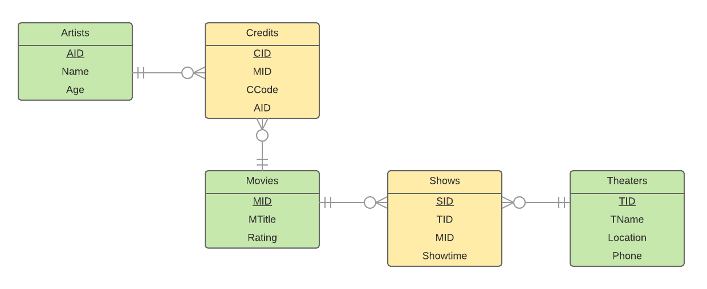

# Data Modeling Notes

## Normalization Analysis
 We're going use Format 3 for our analysis, moving from 1NF to BCNF. While highly redundant, Format 3 is the only one of the three formats that is compatible with the relational data model. Formats 1 and 2 are not compatible with the relational data model.
### 1NF Conversion
DATASHEET (<u>ID</u>,TName,Location,Phone,MTitle,Showtime,Rating,CCode,CName)
### 2NF Conversion    
ID -> (TName,Code,Showtime,CName)   
TName -> (Location,Phone)   
MTitle -> Rating
### BCNF Conversion  
Theaters (TID,TName,Location,Phone)   
Movies (MID,MTitle,Rating)   
Shows (SID,TID,MID,Showtime)   
Artist (AID,Name)

## Entity Relationship Model
<body> 
